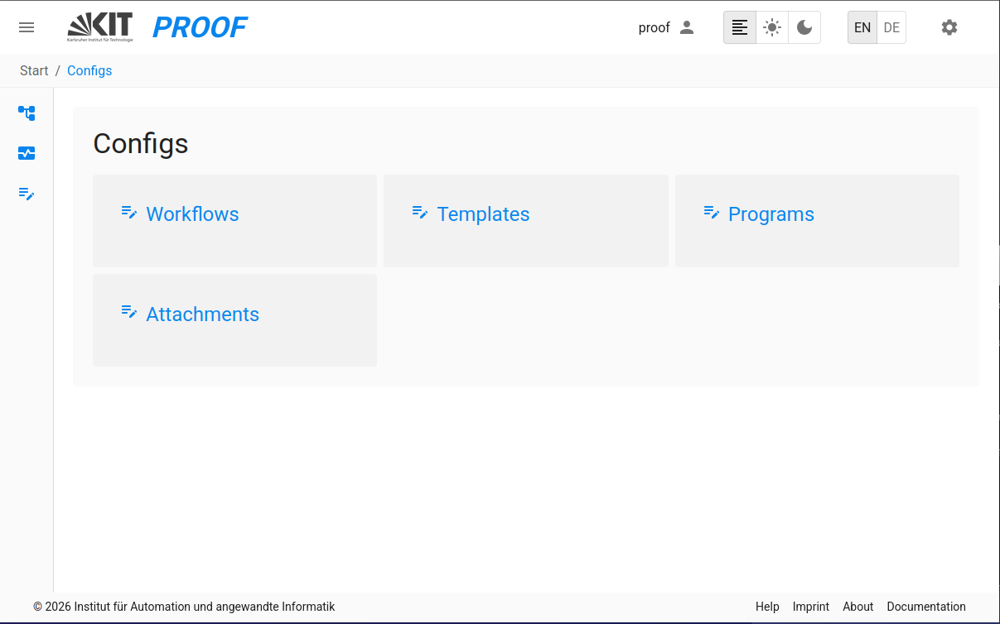
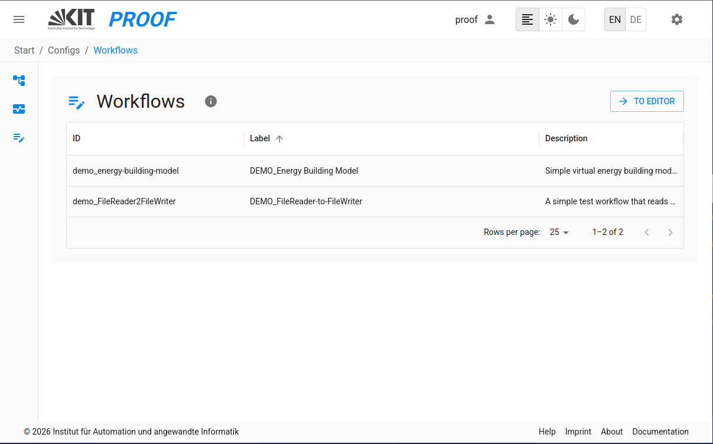
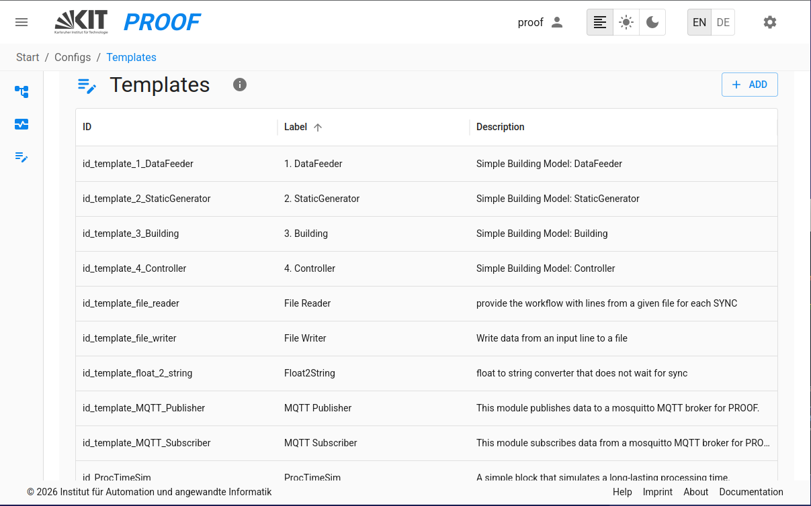
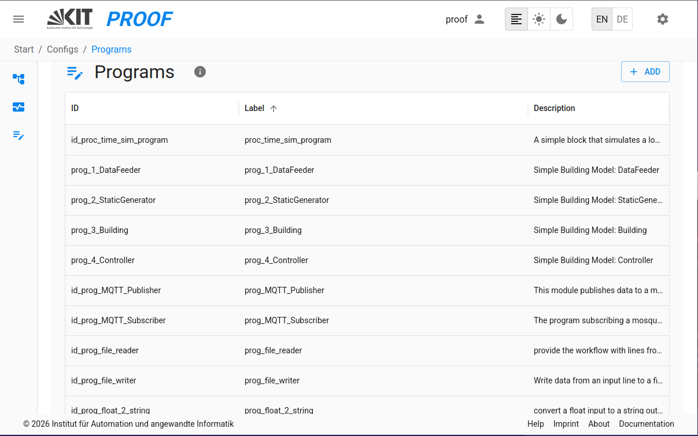
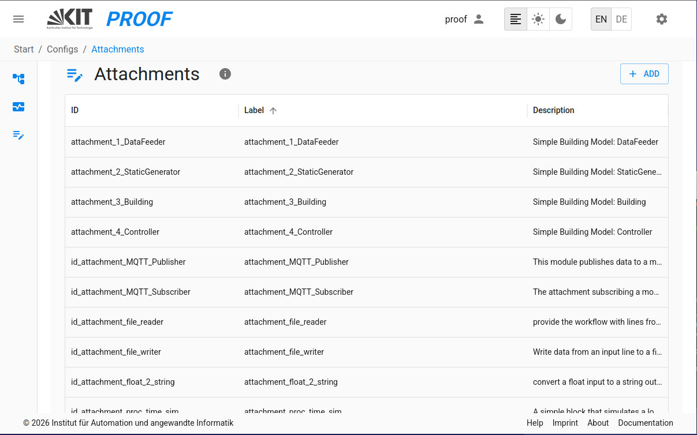

<!--On the proof UI, you can configure new Workflows by selecting the *Workflow Configs* from the menu.-->
## Configuration
The *Configs Tab* is the main interface for managing config files of workflows, templates, programs, and 
attachments in PROOF.
It provides four interfaces for allowing users to operate config files, such as upload, edit, and delete.

### 1. **Workflow Configs**
This interface allows you to manage the config files of workflows.

### 2. **Templates Configs**
This interface allows you to manage the config files of templates.

### 3. **Programs Configs**
This interface allows you to manage the config files of programs.

### 4. **Attachments Configs**
This interface allows you to manage the config files of attachments.

