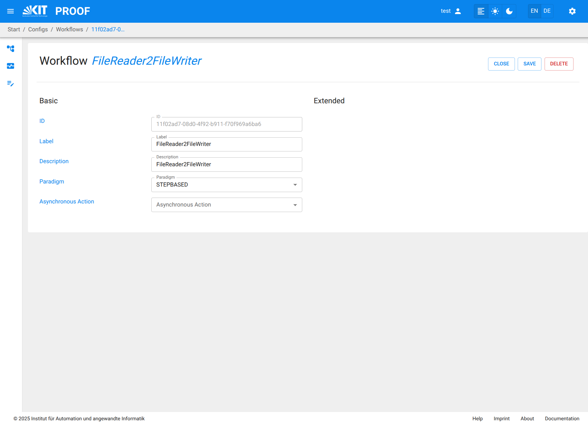

# Create a Workflow in PROOF UI

On the proof UI, you can create new PROOF *Workflows* by selecting the *Workflow Editor* from the menu.
The *Workflow Editor* is the main interface for creating and managing *Workflows* in PROOF.
It provides a visual representation of the Workflow structure, allowing users to drag and drop Blocks, connect them, and configure their settings.
 

## Add a new Workflow
   - You can create a new Workflow by clicking on the "*+*" button in the Workflow Editor to the right of the Workflow combo box .
   - This opens a new empty Workflow canvas where you can start building your Workflow.
   

## Add PROOF *Blocks* to the *Workflow* from *Block Templates*
   - You can drag and drop *Block Templates* from the right sidebar onto the Workflow canvas.
   - Each Block Template represents a predefined specific functionality or model that can be used in the Workflow.
   - A *Block* is created as an instance of the *Block Template* when it is added to the Workflow.
   - The connectable inputs and outputs of each Block are represented by small circles on the left and right sides of the Block, respectively.
   
   
## Connect Blocks
   - You can connect Blocks by clicking on the output of one Block and dragging it to the input of another Block.
   - This establishes a data flow between the Blocks, allowing them to communicate and share data.
   - When trying to connect Blocks, only compatible input and output pins are connectable. Compatible pins have the same color and data type.
    

## Configure Workflow Settings
   - You can configure the settings of the Workflow by clicking on the "Settings" button in the top right corner of the Workflow Editor.
   - This allows you to set ID, label, description, paradigm, and asynchronous Action for the entire Workflow.
   - By clicking on the "save" button, the Workflow settings are saved.
     

## Configure *Block* Settings
   - You can configure the Name of each Block by clicking on it and accessing the Block configuration panel.
   - It is not possible to change the basic functionality of a Block, as it is defined by the Block Template. 
     It is possible to change nearly all Template attributes as well as the associated Program and Attachments using the Template Configuration panel.
     

## Save the *Workflow*
   - Once you have built your Workflow, you must save it by clicking on the "Save" button in the top right corner of the Workflow Editor.
   - This saves the Workflow to the PROOF database, making it available for execution and further editing.
     

## Executing the Workflow via Workflow Editor
   - After having saved the Workflow, you can execute it by navigating to the *RUN* button in the top right corner of the Workflow editor.
   - You must enter all relevant Execution values in the pop-up execution dialog, such as Execution ID, Description, and other parameters specific to the Workflow.

## Executing the Workflow via Monitoring Panel
   - You can also start a saved Workflow from the *Workflow Monitoring* panel in the PROOF UI.
   - Click the *Workflow Monitoring* menu item in the left menu bar to open the monitoring interface.
   - Press the "RUN Workflow" button in the top right corner of the Workflow Monitoring interface. A Combo box appears listing all saved Workflows.
   - Select the saved Workflow from the list and click on the "Start" button to initiate the execution.
   - Enter all necessary attribute values in the pop-up execution dialog, such as Execution Label, Description, and all start values for the given Inputs.
   - Monitor the execution progress and view results through the Workflow Monitoring interface.
     
