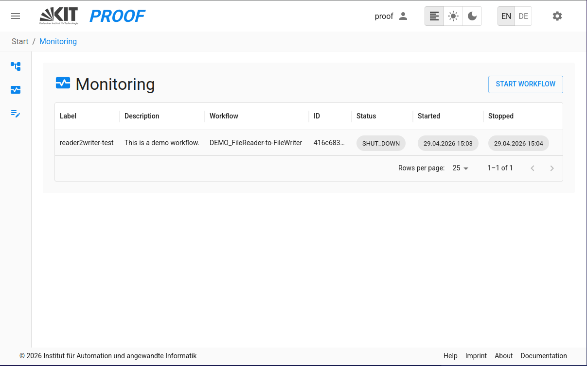
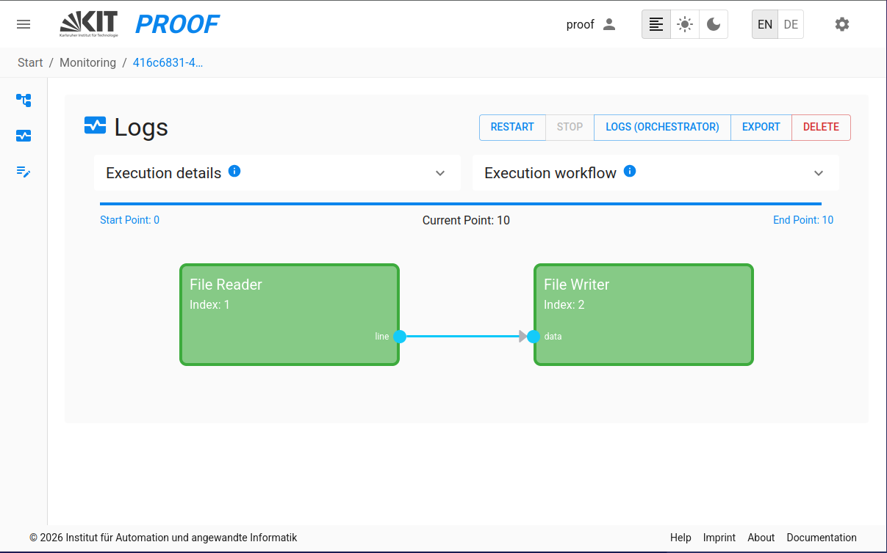
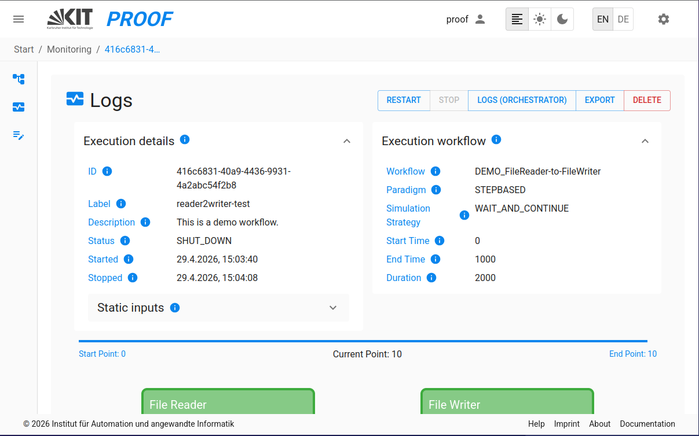

On the proof UI, you can monitor Workflows by selecting the *Monitoring* from the menu.
## Workflow Monitoring
The Workflow Monitoring is the main interface to run, execute, and stop workflows and check logs in PROOF.

### 1. **Monitoring**
This interface allows you to monitor the status of workflows, including their execution status, logs, and other relevant information.

### 2. **Execution Progress Tracking**
During execution, PROOF provides real-time progress tracking:
- **Progress Visualization**: Visual progress bars showing the current state of execution
- **Communication Point (CP) Tracking**: See the current communication point being processed
- **Input Values Display**: View input values and workflow parameters for the execution
- **Execution Parameters**: Full visibility of workflow start and run parameters in the monitoring view
  - Detailed execution settings display with better layout and readability
  - View all execution configuration details

### 3. **Block Status Monitoring Service**
The Block Status Monitoring Service provides real-time visualization of individual block execution states:
- **Real-time Block Status Updates**: Monitor individual block states and communication points
- **Block-specific Logs**: Monitor the logs of individual blocks in real-time
- **Status Indicators**: Visual indicators showing each block's current state (INIT, EXECUTE, FINALIZE, SHUTDOWN)
- **Log Storage**: Model logs are automatically saved in `proof-environment/data/executions/` organized by execution ID as specified in the docker-compose file

### 4. **Run Workflow**
After a workflow is selected in the dropdown list, it can be executed by clicking on the "Run" button in the top right 
corner of the Execution Monitoring interface.

### 5. **Export Executions**
- **Export Execution**: Export a complete workflow execution as a ZIP file, including all configurations, templates and attachments. This feature is available to all users.