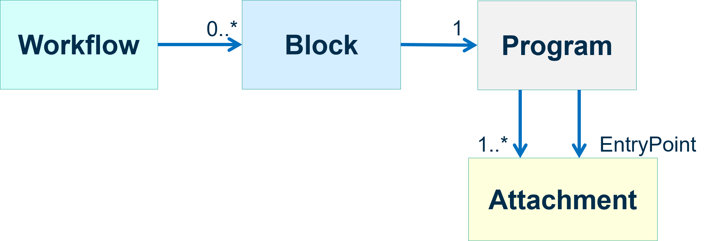
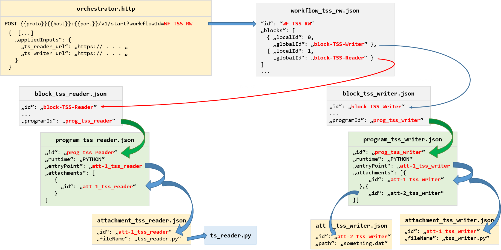

# PROOF *Workflow* Structure
A *PROOF Workflow* contains a set of connected *Blocks* and defines how these blocks are coupled and which in- and outputs are connected to allow data transfer. 

The following image illustrates the data model of a Workflow:

<!---->

<!---->

## Creating workflows 
see: [Creating Workflows](../UI/creating-workflows.md) 

## Monitoring a Workflow

see: [Workflow Monitoring](monitoring-workflows.md)

## Configuring Workflows

see: [Workflow Configuration](../UI/configs.md#1-workflow-configs)
 